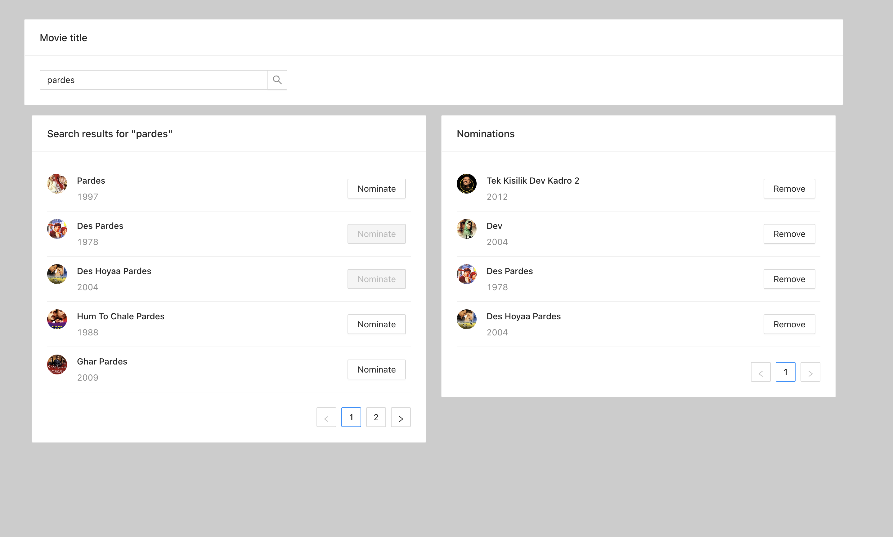

# OMDB - ContactOut
Used React JS to build the application

#### Reference image

### Accessing The Application
I have deployed the application here at https://enchanting-unicorn-789d07.netlify.app/
### Video Links
- Application Walkthrough : https://www.loom.com/share/6785b7ad4ae1440aba6275e78376dec4
- Code Walkthrough : https://www.loom.com/share/3b0c3dab19384f88b88a7ae6b39ab8a7

### Running The Application On Local
- Unzip the file _omdb-contactout.zip_
- Move inside the unzipped directory using the command `cd omdb-contactout`
- Run `npm ci` to install all the dependencies
- Run `npm start` to start the local development server
- If you want to host this on to a HTTP server, run `npm build` and then put the contents inside the `build` folder into the root directory of the HTTP server.
